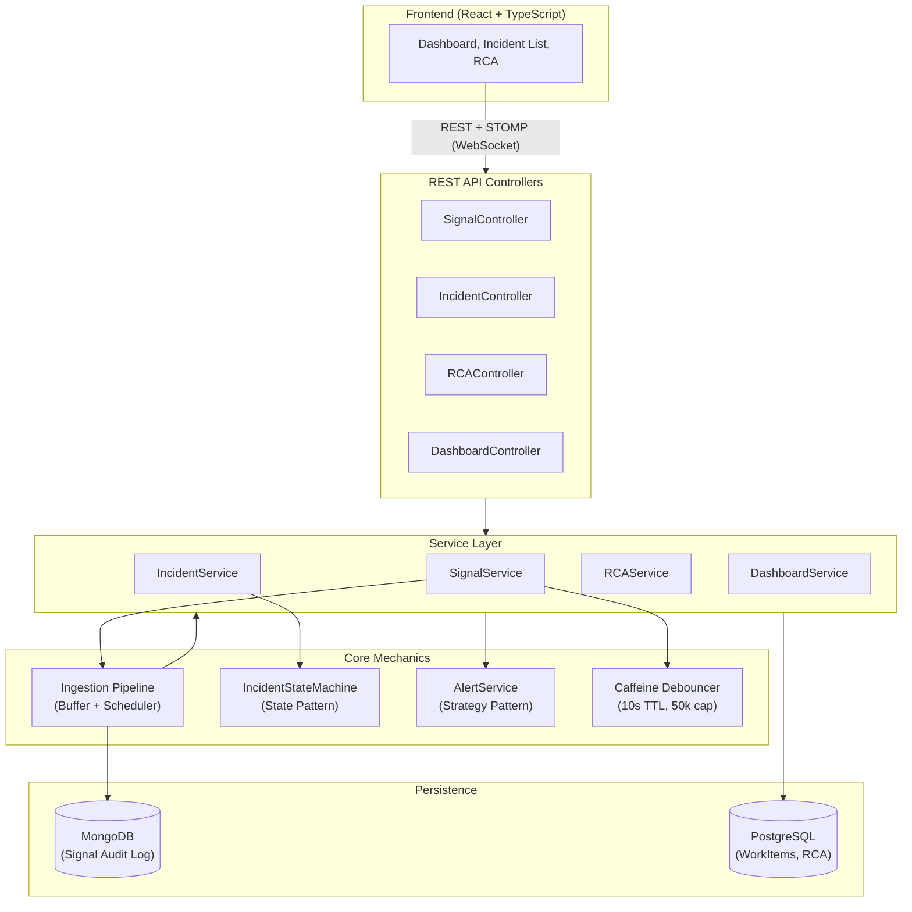

<div align="center">
  <h1> Incident Management System (IMS)</h1>
  <p>A production-grade platform to ingest, triage, investigate, and close infrastructure incidents at scale.</p>

  
  
  
  
  
  
</div>

<hr />

##  Key Features

- **High-Throughput Ingestion**: Handles 10,000+ signals/sec using asynchronous buffer queues and Bucket4j rate limiting.
- **Strict Incident Lifecycle**: Enforces workflow transitions (`Open` → `Investigating` → `Resolved` → `Closed`) via the GoF State Pattern.
- **Signal Debouncing**: Correlates floods of identical alerts into single incidents using an in-memory Caffeine cache.
- **Real-Time Updates**: Pushes live incident state changes directly to the React UI via STOMP/WebSockets.
- **Root Cause Analysis (RCA)**: Mandatory RCA submission prior to closing incidents, including automated MTTR calculations.
- **Dynamic Priority Alerting**: Strategy-pattern-based alerting (P0 pages on-call, P1 alerts team, P2 logs).

---

##  Architecture

The system relies on a decoupled producer-consumer architecture for ingestion, alongside a strict state machine for incident lifecycle management.

### Architecture Diagram



---

##  Setup & Installation

The application relies on PostgreSQL for relational data and MongoDB for high-throughput signal auditing.

### Prerequisites

- Docker & Docker Compose
- PostgreSQL 17 (or compatible) installed locally
- Java 17 & Maven
- Node.js & npm

> [!NOTE]  
> Make sure no other services are running on ports `8080` (Backend), `5173` (Frontend), `5432` (Postgres), or `27017` (MongoDB).

### 1. Database Setup

First, start the MongoDB container using Docker Compose:

```bash
docker compose up -d mongo
```

Next, configure the local PostgreSQL database using the provided PowerShell script (assuming `psql.exe` is in your PATH or at `C:\Program Files\PostgreSQL\17\bin\psql.exe`):

```powershell
.\scripts\setup-db.ps1
```
*(This script creates the `ims_user`, `ims_db` database, and grants necessary privileges).*

### 2. Run the Backend (Spring Boot)

Navigate to the backend directory and start the application:

```bash
cd backend
mvn clean install -DskipTests
mvn spring-boot:run
```

### 3. Run the Frontend (React + Vite)

In a new terminal window, navigate to the frontend directory, install dependencies, and start the development server:

```bash
cd frontend
npm install
npm run dev
```

> [!TIP]  
> The frontend is available at `http://localhost:5173` and the backend API runs at `http://localhost:8080`.

---

##  Handling Backpressure

At scale, database write latency can cause cascading failures if the ingestion API is synchronous. IMS handles high-throughput bursts (e.g., 10,000 signals/second) by applying rigorous backpressure and decoupling techniques:

1. **API Rate Limiting (Bucket4j):**
   The `SignalController` employs a token bucket algorithm to enforce an API-level rate limit of **5,000 requests per second**. Exceeding this instantly returns `429 Too Many Requests`.

2. **Asynchronous Ingestion Pipeline:**
   Incoming signals are placed into a `LinkedBlockingQueue` (capacity: 50,000) using a non-blocking `offer()` operation, immediately returning a `202 Accepted` response to the client.

   > [!IMPORTANT]  
   > If the queue is full (indicating processing cannot keep up with ingestion), `offer()` fails instantly and returns `503 Service Unavailable`, strictly preventing memory exhaustion (`OutOfMemoryError`).

3. **Batch Processing & Debouncing:**
   A background scheduled task drains the queue (up to 500 signals every 100ms). Signals are debounced via an in-memory **Caffeine cache** (10s TTL) to prevent redundant database hits. The batched payload is then asynchronously persisted to MongoDB. If persistence fails, the batch is re-queued for retry.

---

##  Testing

To run the comprehensive test suite (Unit + Integration tests) for the backend:

```bash
cd backend
mvn test
```

*The test suite covers the incident state machine, rate limiting, asynchronous signal ingestion, and integration workflows.*
